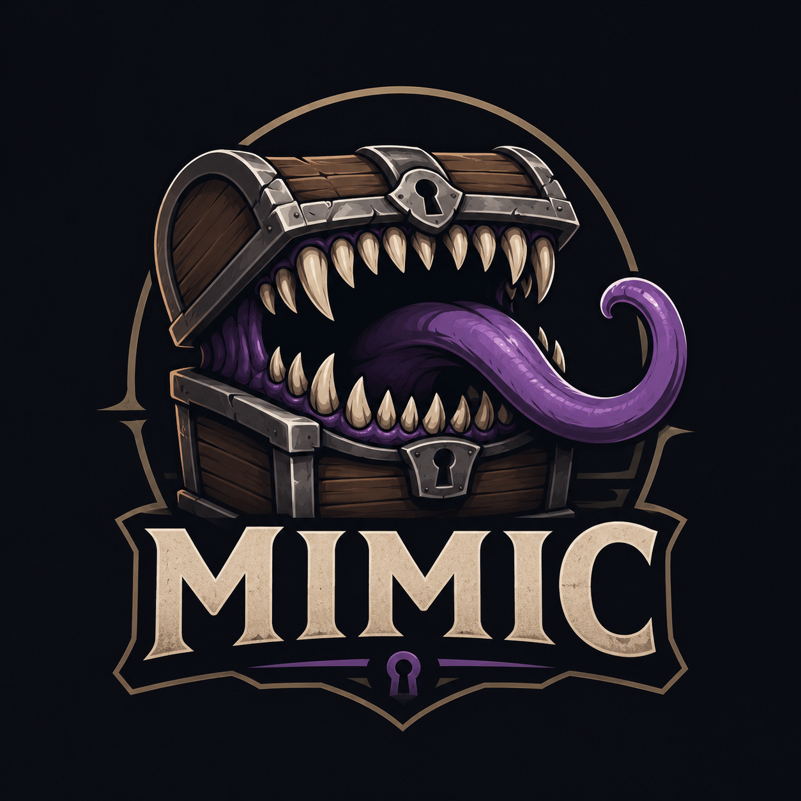

<p align="center">
  
</p>

# Mimic

A lightweight platform that simulates third-party providers used by GolgiMed — for local development, integration testing, and CI, when you don't have (or don't want to depend on) real sandbox access.

Looks like the real provider. Bites different.

It emulates provider HTTP contracts, state transitions, and webhooks with predictable, configurable behavior. It is **not** a production system, and it does not try to reproduce every detail of the real providers — see [CLAUDE.md](CLAUDE.md) for the project's design philosophy.

Third-party provider sandboxes are often unavailable, incomplete, slow, rate-limited, or difficult to reproduce consistently in CI. Mimic provides a deterministic local replacement that behaves enough like the real provider for integration testing.

## Why Mimic?

When integrating with third-party providers, you usually have three options:

| Approach | Good for | Limitations |
|----------|----------|-------------|
| Unit-test mocks | Testing your own business logic | Doesn't validate HTTP contracts, retries, webhooks, or integration behavior |
| Provider sandbox | End-to-end validation | Can be slow, unavailable, rate-limited, incomplete, or difficult to automate |
| Mimic | Local development, integration tests, and CI | Simulates the provider rather than being the provider itself |

Mimic exists to fill the gap between mocks and real providers.

It behaves like an external service, exposing the same HTTP endpoints, payloads, asynchronous processing, state transitions, and webhooks, while remaining deterministic, fast, and entirely local.

This lets you:

- develop integrations offline;
- run integration tests in CI without external dependencies;
- reproduce provider failures on demand;
- debug webhook flows deterministically;
- test retry and recovery logic without modifying application code.

Use mocks to test your code.
Use Mimic to test your integration.
Use the real provider to validate production behavior.

## Architecture

Mimic is a multi-provider platform: the core knows nothing about any individual provider's business rules, and adding a new provider requires no changes outside that provider's own directory.

```
cmd/mimic/
    main.go             # entrypoint: wires storage/providers/admin, hands lifecycle to Lane

internal/
    registry/
        registry.go      # Provider type + in-memory registry (Register/Get/All/Enabled)

    core/
        mux.go            # builds the root http.ServeMux, CORS, /health, /dashboard

    openapi/
        loader.go          # parses OpenAPI 3.x specs from specs/
        provider.go         # turns parsed specs into a registry.Provider
        ...

    providers/
        providers.go      # registers every known provider
        zenvia/
            README.md      # provider-specific docs
            provider.go     # Provider{Name, Register(mux), ListItems, GetItemDetail}
            routes.go
            handlers.go
            state.go
            ...
        integraicp/
            README.md
            provider.go
            ...

    shared/
        auth/              # reused by 2+ providers
        faults/
        scheduler/
        storage/
        webhooks/
        admin/             # fault injection + dashboard aggregation, provider-agnostic

db/migrations/            # SQL migrations, embedded into the binary via go:embed
dashboard/                 # static dashboard HTML, embedded into the binary via go:embed
specs/                    # user-dropped OpenAPI specs, served by internal/openapi
```

Each provider owns its routes, request/response payloads, state transitions, and webhook events. `internal/core` only builds the HTTP mux, loads configuration, registers enabled providers, and exposes shared infrastructure (logging, scheduling, storage, webhook dispatcher, fault injection). Server lifecycle — concurrent startup, SIGINT/SIGTERM handling, health checks, graceful shutdown — is handled by [Lane](https://github.com/rluders/lane). Shared modules under `shared/` only exist because they're reused by more than one provider — nothing there knows a provider's business rules.

### Provider registration

A provider is a `*registry.Provider` (see `internal/registry/registry.go`):

```go
type Provider struct {
    Name          string
    Register      func(mux *http.ServeMux)       // mounts routes, e.g. under /zenvia/...
    ListItems     func() []DashboardItem          // optional: feeds the dashboard
    GetItemDetail func(id string) (*ItemDetail, bool)
}
```

`internal/providers/providers.go` registers every known provider into the registry. `internal/core` mounts only the *enabled* ones (see Configuration below).

### Adding a new provider

1. Create `internal/providers/<name>/` with routes, handlers, state, and a `README.md` documenting its endpoints and known limitations.
2. Add a `provider.go` exposing a `New(...) *registry.Provider` constructor (see above).
3. Register it in `internal/providers/providers.go`.
4. No other file needs to change — the core, admin dashboard, and fault injection pick it up automatically.

## Supported providers

- **[Zenvia](internal/providers/zenvia/README.md)** — SMS, WhatsApp, and Email messaging, with subscription-based delivery-status webhooks.
- **[IntegraICP](internal/providers/integraicp/README.md)** — Brazilian digital signature / ICP-Brasil certificate flows.
- **[OpenAPI adapter](specs/README.md)** — drop any OpenAPI 3.x spec into `specs/` and Mimic serves it as a mock provider (route prefix derived from the spec title, optional CRUD persistence), no hand-written code required.

See each provider's README for endpoint-level usage and known limitations.

## Requirements

- Go 1.26+
- Docker + Docker Compose (optional, for containerized runs)

## Getting started

```bash
go run ./cmd/mimic
```

The server listens on `http://localhost:3000` (`PORT` env var to change it). State is a local SQLite file at `db/simulator.sqlite`; delete it to reset. Migrations and the dashboard are embedded in the binary — nothing else needs to be on disk to run it.

Or with Docker:

```bash
docker compose up --build
```

To also serve OpenAPI specs (see [Supported providers](#supported-providers)), use the `serve` subcommand:

```bash
go run ./cmd/mimic serve
```

With no flags, `serve` looks for a `specs/` directory and loads every spec found there. Flags:

| Flag | Purpose |
|---|---|
| `-spec-dir <path>` | Recursively scan a directory for spec files instead of `specs/` |
| `-spec <glob>` | Load spec files matching a glob pattern (repeatable) |
| `-conflict <mode>` | Route-prefix conflict handling across specs: `strict` (default), `merge`, or `priority` |

See [specs/README.md](specs/README.md) for spec discovery, route-prefix derivation (`x-mimic-name`), and CRUD persistence (`MIMIC_OPENAPI_PERSIST`, `x-mimic-persist`).

## Usage

Every endpoint mirrors its real provider's relative path and payload shape as closely as reasonably possible, so a client built against the real API works against the simulator with only its base URL changed. See each provider's README (linked above) for concrete request examples.

## Dashboard

`GET /dashboard` — a single page listing everything the simulator has processed across enabled providers, newest first. Click a row for its raw payload and webhook delivery log.

The "Flush" button (`POST /admin/flush`) wipes every table's data (items, faults, webhook logs) while keeping the schema, so you can reset state between test runs without restarting the server.

## Fault injection

Simulate failures without touching code:

```bash
curl -X PUT http://localhost:3000/admin/faults -H "Content-Type: application/json" \
  -d '{"provider":"zenvia","routePattern":"/zenvia/channels/sms/messages","faultKind":"http_status","faultValue":"503"}'
```

Kinds: `delay_ms`, `http_status`, `timeout`, `invalid_payload`, `webhook_dropped`, `webhook_invalid`, `rate_limited`. Omit `routePattern` to apply to every route for a provider; add `"times": N` to auto-clear after N uses, `"probability": 0.3` to fire only some of the time, or `"delayDistribution"` for jittered latency (`{"kind":"uniform","minMs":50,"maxMs":300}` or `{"kind":"normal","meanMs":100,"stdDevMs":20}`). `GET /admin/faults` lists active faults, `DELETE /admin/faults/:id` clears one.

## Configuration

| Variable | Default | Purpose |
|---|---|---|
| `PORT` | `3000` | HTTP port |
| `DB_PATH` | `db/simulator.sqlite` | SQLite file path |
| `LOG_LEVEL` | `info` | Logger level |
| `DEFAULT_DELAY_MS` | `0` | Baseline simulated processing latency |
| `SCHEDULER_INTERVAL_MS` | `1000` | Background job poll interval |
| `MIMIC_PROVIDERS` | *(all registered)* | Comma-separated list of provider names to enable, e.g. `zenvia,integraicp` |
| `MIMIC_OPENAPI_PERSIST` | `false` | Enable real CRUD persistence for spec-mocked routes (see [specs/README.md](specs/README.md)) |

Provider-specific variables (e.g. `ZENVIA_STATUS_DELAY_MS`) are documented in each provider's README.

### Enabling/disabling providers

By default every registered provider is enabled. To run only a subset:

```bash
MIMIC_PROVIDERS=zenvia go run ./cmd/mimic
```

or in `.env`:

```
MIMIC_PROVIDERS=zenvia,integraicp
```

## Testing

```bash
go vet ./...
go test ./...
```

Integration tests spin up the app in-process (`net/http/httptest`) against an in-memory SQLite database (`tests/`).

## Limitations

- **OpenAPI parsing is intentionally minimal.** The adapter understands `paths`, operations, and inline `schema`/`example`/`examples` — it does not resolve `$ref`, `oneOf`, `allOf`, or `anyOf`. A spec using any of these logs a warning at boot and the affected schemas fall back to a stub/empty body rather than failing to load. Most real-world specs use `$ref` for shared/component schemas, so expect stubs there until this is addressed (see Roadmap).
- **CRUD persistence only covers single-level resources.** A collection route with zero path parameters (`/pets`) or an item route with exactly one trailing path parameter (`/pets/{id}`) is inferred as CRUD. Nested resources (`/pets/{id}/vaccinations`) or routes with multiple path parameters keep static example/stub behavior regardless of `MIMIC_OPENAPI_PERSIST`. See [specs/README.md](specs/README.md).
- Mimic is not a production system and doesn't try to reproduce every detail of a real provider — see [CLAUDE.md](CLAUDE.md) for the design philosophy behind that tradeoff.

## Roadmap

- Replace the hand-rolled OpenAPI parser with a real parsing library (e.g. `kin-openapi` or `libopenapi`) to add `$ref`/`oneOf`/`allOf`/`anyOf` support.
- Everything else is driven by whatever new provider or simulation need comes up next — see [CLAUDE.md](CLAUDE.md)'s "Adding a new provider" section if you want to contribute one.

## Contributing

Contributions are welcome — see [CONTRIBUTING.md](CONTRIBUTING.md) for how to build, test, and submit changes, and [CLAUDE.md](CLAUDE.md) for the project's design philosophy (what Mimic is and deliberately isn't).

## License

Apache License 2.0 — see [LICENSE](LICENSE).
